# Eachine Tyro79 - CAD FILES

This is a work in progress and includes various cad files relating to the Eachine Tyro79. All models were made using [solvespace](https://solvespace.com/index.pl), a free and fun to use CAD application.

## Files

## Frame

1. [side plate](src/frame/sideplate.slvs) - This is a side plate with a cm basis
1. [side plate - scaled](src/frame/sideplate-scaled.slvs) - This is a side plate with a mm basis

## Misc

1. [SQ12 Action Cam](src/misc/sq12.slvs) - reference model of SQ12 action cam

## Camera Mounts

1. [Insta360 Go](src/mount/insta360go.slvs) - camera mount for the insta 360 go camera
2. [Runcam 5](src/mount/runcam5.slvs) - camera mount for the RunCam 5 action camera.
3. SQ12 - Work in progress

### Insta 360 Go

This mount requires 4 x M2 screws and washers. It is also available as a printable STL file on [Thingiverse](https://www.thingiverse.com/thing:4792154)

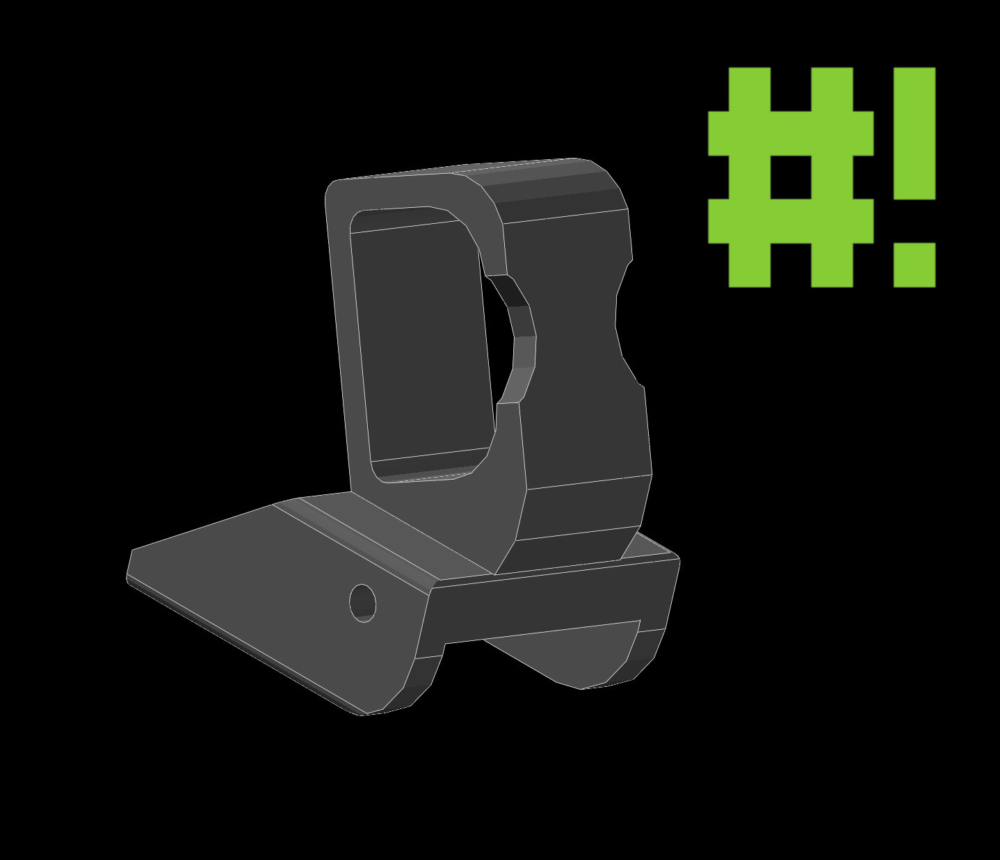
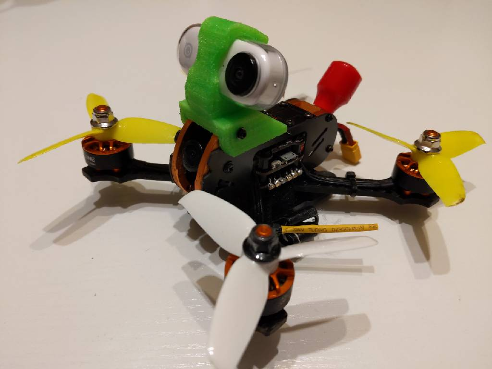
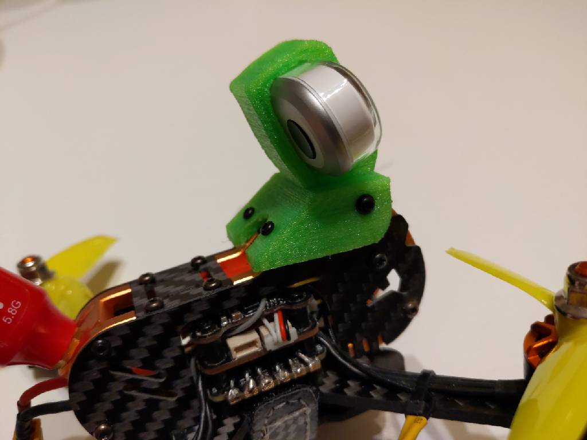
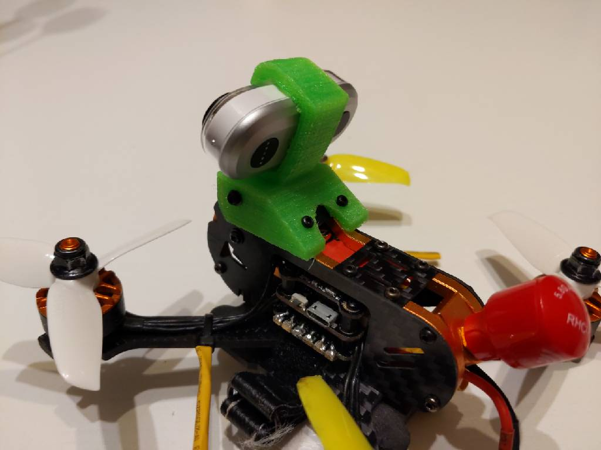

### Runcam 5

This mount requires 4 x M2 screws and washers. It is also available as a printable STL file on [Thingiverse]()

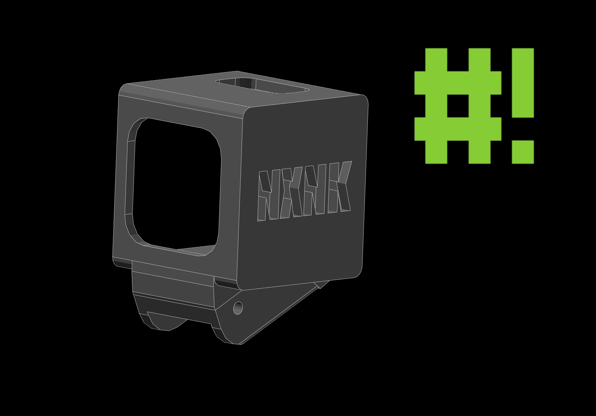
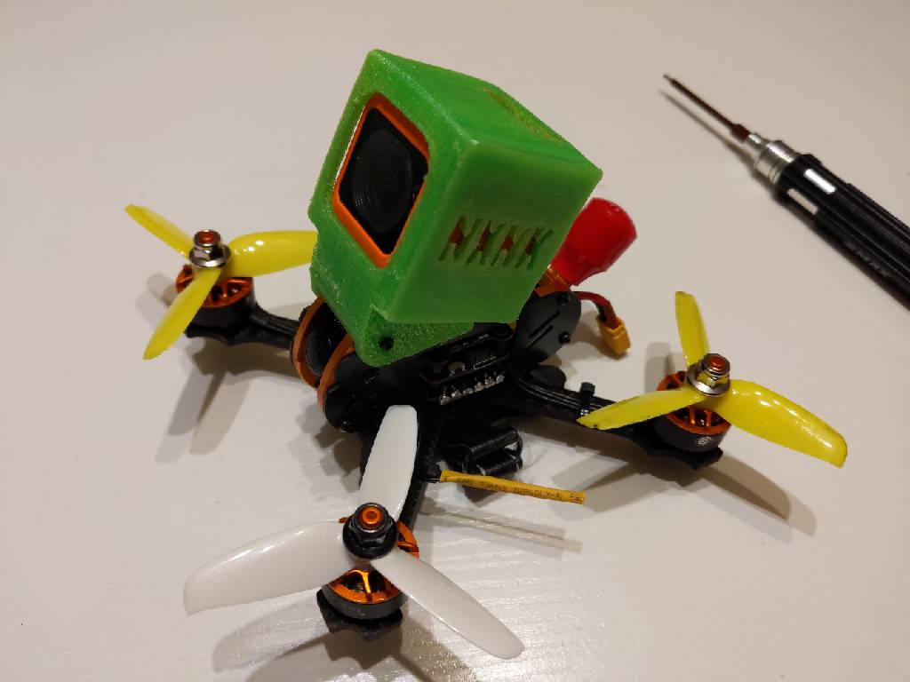
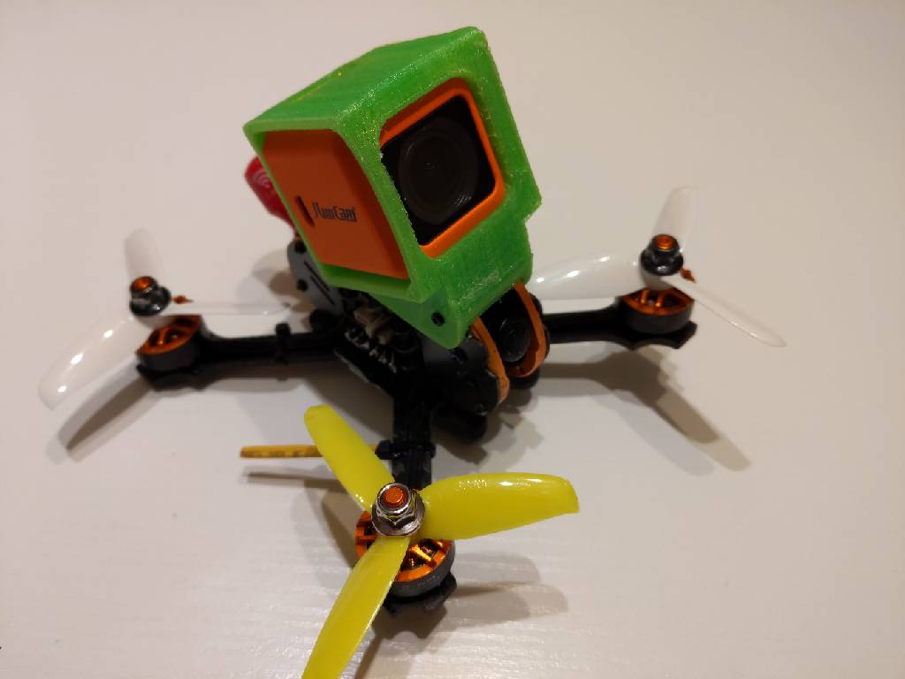

### Runcam 5

The SQ12 mount is a rework of a mount I already made. However, this version has an updated base. A different version is already available on [github](https://github.com/nuxnik/tyro79-sq12-mount) and also as a printable STL file on [Thingiverse](https://www.thingiverse.com/thing:4700483)

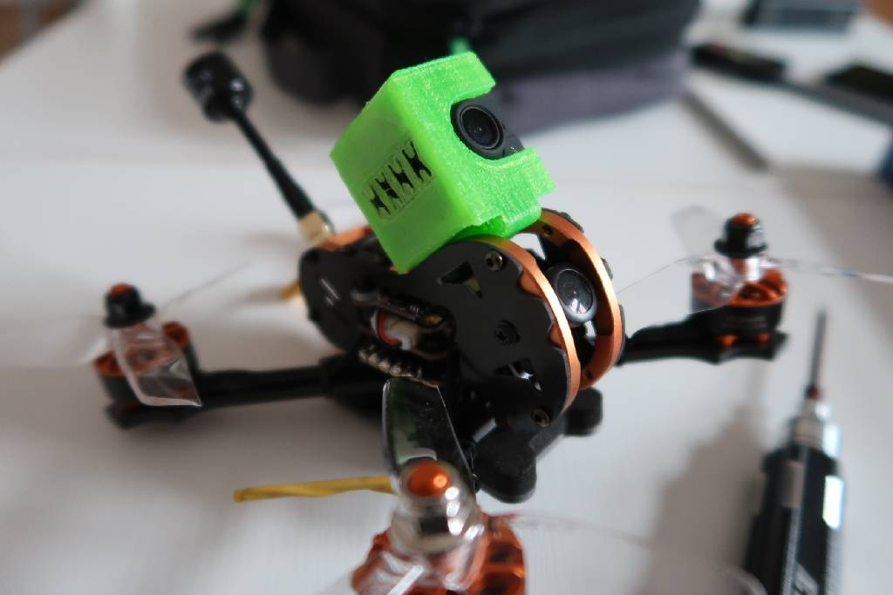
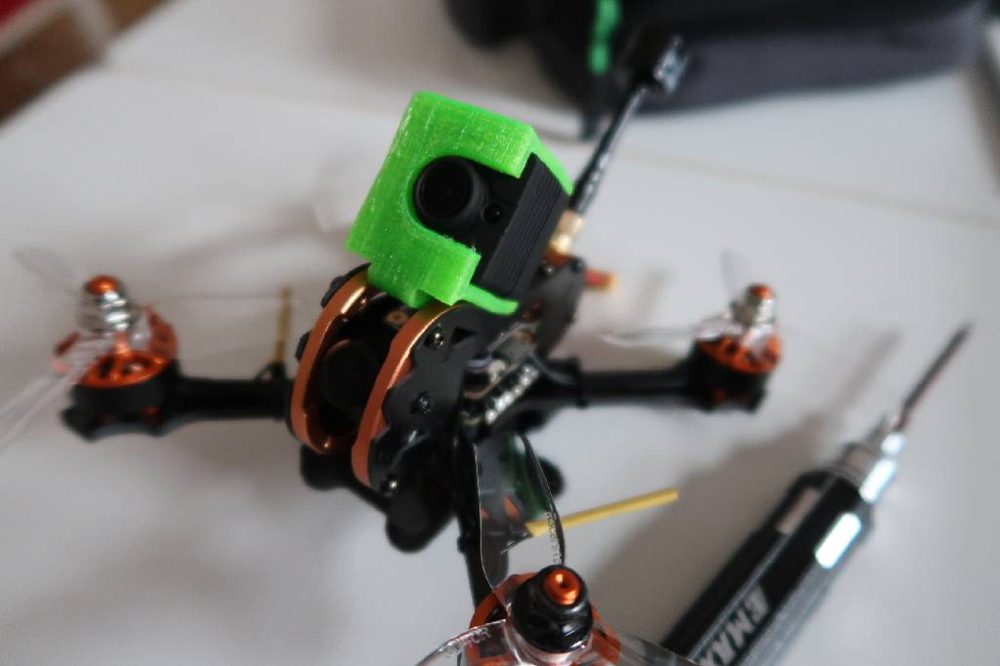
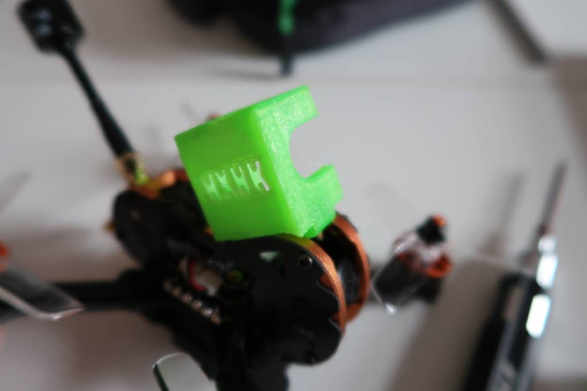
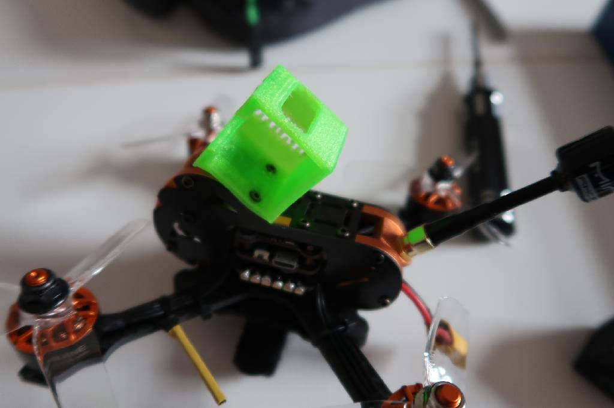

